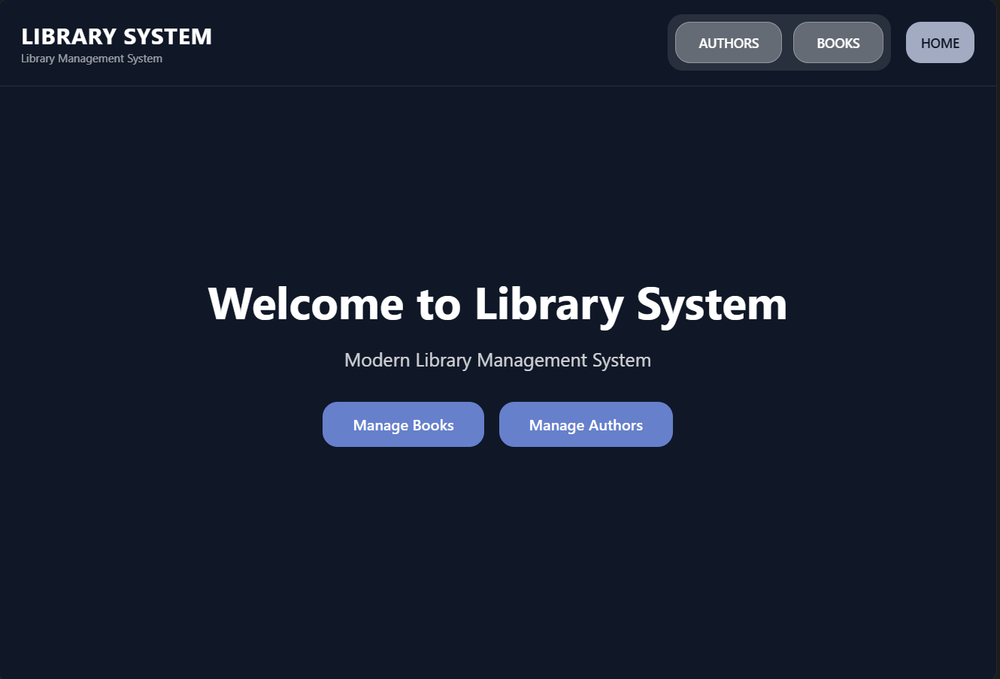
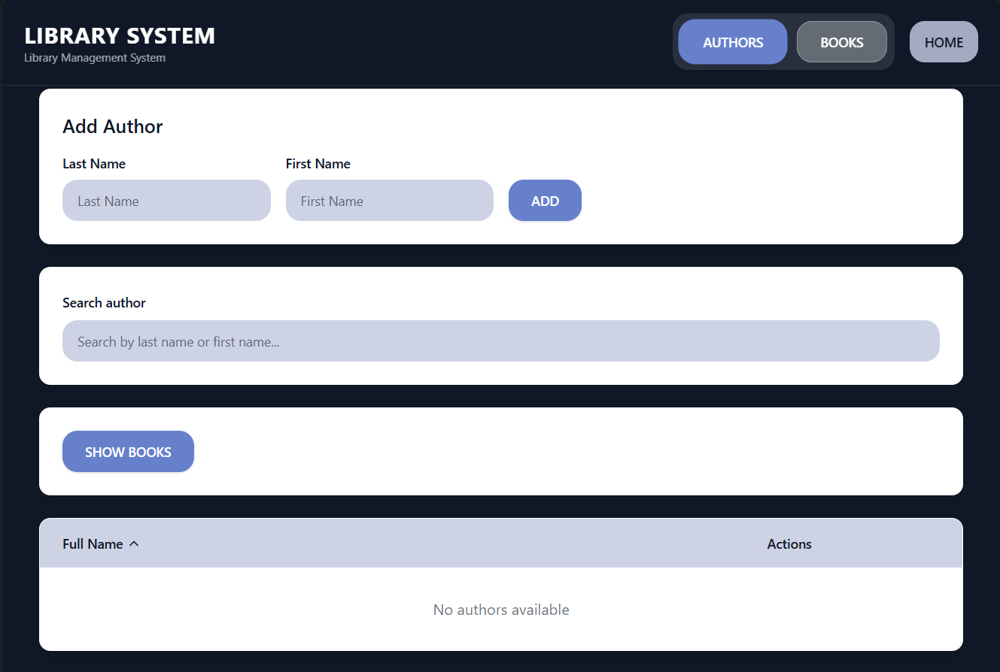
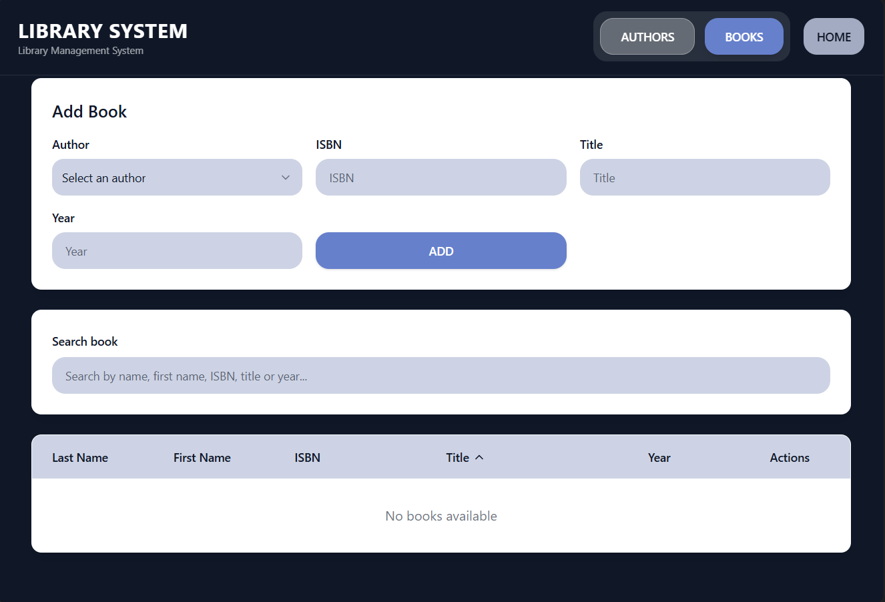

# Library Management System

A modern, comprehensive library management system designed for administrators to efficiently manage books, authors, and library operations.

## Tech Stack

- Vite
- TypeScript
- React
- shadcn-ui
- Tailwind CSS
- Framer Motion

##  Screenshots

   
   
   
