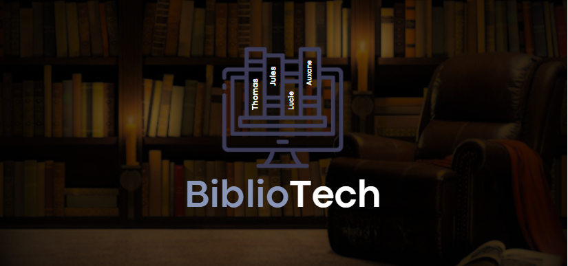
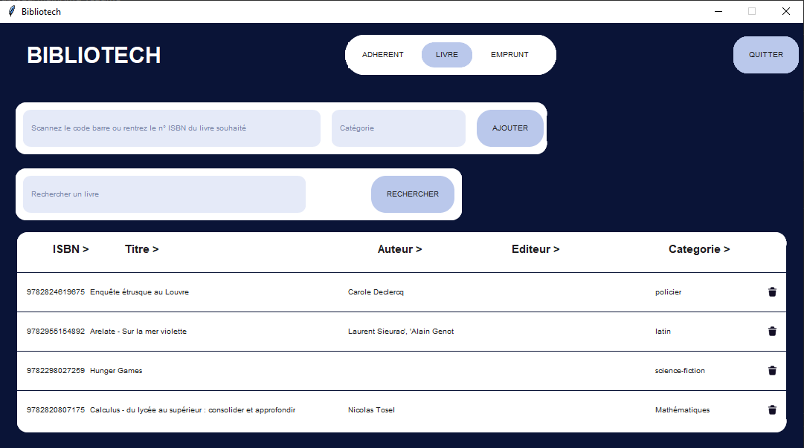
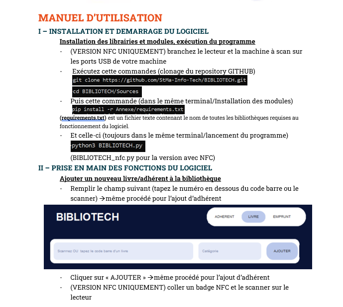
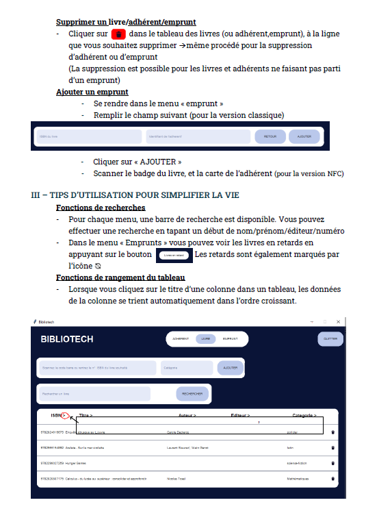

# 📚 BIBLIOTECH

<p align="center">
  
</p>

<p align="center">
  
  
  
  
  
</p>

<p align="center">
  <b>Modern Contactless Library Management System</b><br/>
  (Consultez la version en <a href="README_fr.md">Français 🇫🇷</a>)
</p>

---

## 📌 Table of Contents
1. [Overview](#-overview)
2. [Key Features](#-key-features)
3. [User Interface](#-user-interface)
4. [Technologies Used](#-technologies-used)
5. [Installation & Setup](#-installation--setup)
6. [Usage Guide](#-usage-guide)
7. [Project Architecture](#-project-architecture)
8. [Author & Credits](#-author--credits)

---

## 🌟 Overview

**BIBLIOTECH** is a comprehensive, intuitive desktop application designed for modern library operations. It bridges physical media with digital cataloging through automated ISBN metadata lookup and optional contactless NFC / RFID badge integration for instant member identification and book checkouts.

---

## ✨ Key Features

- 📖 **Catalog Management**: Add, search, sort, and remove books with automatic metadata retrieval (title, author, publisher, category) via ISBN lookup.
- 👤 **Member Directory**: Manage library subscribers with contact details, custom identifiers, and quick profile search.
- 🔄 **Loan & Return Tracking**: Simple 1-click borrowing and return workflow with automatic return date calculation (30 days default).
- ⏰ **Overdue Monitoring**: Dedicated overdue loan tracker highlighting late returns with quick-action indicators.
- 🏷️ **Contactless NFC Integration**: Support for NFC/RFID card readers for rapid member scanning and contactless operations.
- 🎨 **Modern Responsive UI**: Built with CustomTkinter featuring dark theme aesthetics, smooth pagination, and live sorting.

---

## 🖥️ User Interface

### Main Dashboard (Books View)
<p align="center">
  
</p>

### Member Directory & Borrowing Interface
<p align="center">
  
  &nbsp;&nbsp;
  
</p>

---

## 🛠️ Technologies Used

| Technology | Purpose |
| :--- | :--- |
| **[Python 3](https://www.python.org/)** | Core programming language |
| **[CustomTkinter](https://github.com/TomSchimansky/CustomTkinter)** | Modern desktop GUI framework |
| **[SQLite3](https://docs.python.org/3/library/sqlite3.html)** | Embedded relational database engine |
| **[isbnlib](https://pypi.org/project/isbnlib/)** | Automated bibliographic data and metadata extraction |
| **[Pillow (PIL)](https://pillow.readthedocs.io/)** | Image rendering and asset processing |
| **[nfcpy](https://nfcpy.readthedocs.io/) / smartcard** | NFC / RFID reader communication (for NFC mode) |

---

## 🚀 Installation & Setup

### Prerequisites
- Python 3.9 or higher installed on your system.

### 1. Clone the repository
```bash
git clone https://github.com/tayebg/BIBLIOTECH.git
cd BIBLIOTECH
```

### 2. Create and activate a Virtual Environment
```bash
# Windows
python -m venv .venv
.venv\Scripts\activate

# Linux / macOS
python3 -m venv .venv
source .venv/bin/activate
```

### 3. Install Dependencies
```bash
pip install -r sources/Annexe/requirements.txt
```

### 4. Run the Application

#### Standard Desktop Version (No NFC hardware required)
```bash
cd sources
python BIBLIOTECH.py
```

#### Contactless Hardware Version (With NFC reader)
```bash
cd sources
python BIBLIOTECH_nfc.py
```

---

## 📖 Usage Guide

1. **Adding Books**: Navigate to the **LIVRE** tab, type or scan the book's ISBN, enter a category, and click **AJOUTER**. Book details are automatically fetched and displayed in a confirmation popup.
2. **Adding Members**: In the **ADHERENT** tab, enter the subscriber's name, email, and phone number, then click **AJOUTER**.
3. **Borrowing a Book**: In the **EMPRUNT** tab, enter the book's ISBN and member ID, then click **AJOUTER**.
4. **Returning a Book**: In the **EMPRUNT** tab, provide the book ISBN and member ID, then click **RETOUR**.
5. **Viewing Late Returns**: Click **Livres en retard** on the Emprunt tab to filter overdue items.

---

## 📁 Project Architecture

```
BIBLIOTECH/
├── img_readme/              # Screenshots and visual assets
├── sources/
│   ├── Annexe/
│   │   ├── font/            # Typography (Outfit Font)
│   │   ├── icones/          # UI Icon assets
│   │   └── requirements.txt # Python dependencies
│   ├── nfc/                 # NFC driver and helper modules
│   ├── BIBLIOTECH.py        # Main standard desktop application
│   ├── BIBLIOTECH_nfc.py    # Contactless NFC-enabled application
│   ├── bibliotheque.db      # SQLite database (standard)
│   └── bibliotheque_nfc.db  # SQLite database (NFC)
├── .gitignore
├── README.md                # English documentation
└── README_fr.md             # French documentation
```

---

## ✍️ Author & Credits

- **Author & Maintainer**: [Tayeb Bekkouche (@tayebg)](https://github.com/tayebg)  
- **Email**: [tayebekk2004@gmail.com](mailto:tayebekk2004@gmail.com)  
- **Repository**: [https://github.com/tayebg/BIBLIOTECH](https://github.com/tayebg/BIBLIOTECH)

> *Project re-engineered, modernized, and maintained by Tayeb Bekkouche.*
